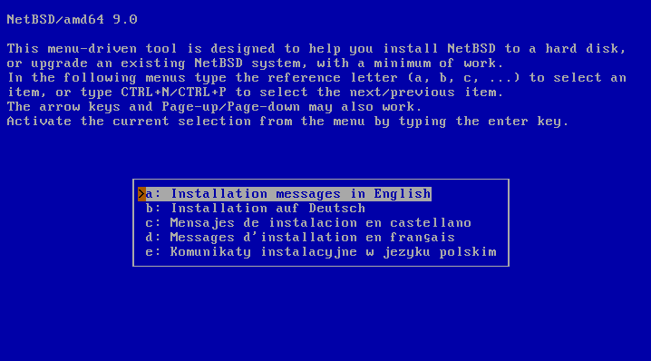
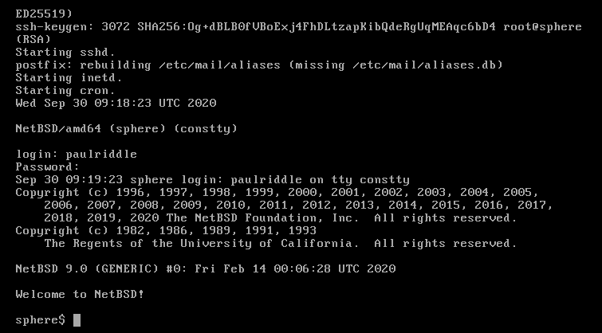

+++
title = "NetBSD development box with QEMU"
template = "netbsd.html"
date = 2020-09-30
updated = 2020-09-30
[extra]
tags = []
+++

# NetBSD development box with QEMU

Download [here](https://www.netbsd.org/). For x86-64 I'm downloading amd64 CD
iso image. Create a qcow2 image, where the system will be installed:
```
 qemu-img create -f qcow2 netbsd.qcow2 16G
```
16G should be sufficient. At the time of creation you don't have to have 16G
available because the image will grow as needed. Then

```fish
qemu-system-x86_64 \
  -m 1024 \
  -monitor stdio \
  -enable-kvm \
  -boot d \
  -smp 2 \
  -nic user,hostfwd=tcp:127.0.0.1:2222-:22 \
  -hda netbsd.qcow2 \
  -cdrom NetBSD-9.0-amd64.iso
```

In order:
  * `-m 1024` this much of memory in MB.
  * `monitor stdio` so that you have the QEMU console for stuff.
  * `enable-kvm` for efficiency, otherwise things will be slow.
  * `smp 2` gives two CPUs to NetBSD.
  * `-nic user,hostfwd=tcp:127.0.0.1:2222-:22` makes the internet work and maps
      port 2222 on the host to port 22 in the NetBSD. SSH will be on port 22.
  * `hda netbsd.qcow2` this is where we're installing the system.
  * `cdrom NetBSD-9.0-amd64.iso` as if we have inserted the CD.

You'll see the installation screen:



Then it goes like this:

```
a: Installation messages in English
a: unchanged
a: Install NetBSD to hard disk

Shall we continue? Yes or no?
b: Yes

Available disks
a: wd0 (16G)

Partition scheme
b: Master Boot Record (MBR)

The disk matches the following BIOS disk: ... (a table) ...
a: This is the correct geometry

We are now going to install NetBSD on the disk wd0. What would you like to do?
b: Use the entire disk

Partitioning.
b: Use default partition sizes

You'll see a partition table.
x: Partition sizes ok

Shall we continue?
b: Yes

Bootblocks selection
a: Use BIOS console

Select your distribution
b: Installation without X11

Install from
a: CD-ROM / DVD / install image media
```

At this point extraction is complete. Next step is to configure the network.

## Network

Select
```
a: Configure network

Available interfaces
a: wm0

Network media type [autoselect]:
autoselect (or just hit Enter)

Perform autoconfiguration?
a: Yes

Your DNS domain:
<leave blank by hitting Enter>

The following are the values you entered. Are they OK?
a: Yes

Is the info correct and do you want it installed in /etc?
a: Yes
```

## pkgin

```
e: Enable installation of binary packages
x: Install pkgin and update package summary
I have some issues here.
```

## Other stuff

```
g: Enable sshd
h: Enable ntpd

o: Add a user
8 character username to add: paulriddle

Add to group wheel?
a: Yes

User shell
a: /bin/sh

Set the password.

x: Finish configuring
>Hit enter to continue

x: Exit Install System
```
Now you're in the shell. Type:
```
mount /dev/wd0a /mnt
vi /mnt/etc/rc.conf
```
Append two lines:
```
no_swap=YES
hostname=sphere
```
Then unmount and reboot:
```
umount /mnt
shutdown -r now
```
Login:



Now leave that window be. Open a new terminal and ssh into the machine:
```
ssh -p 2222 paulriddle@localhost
```
If you get a warning, that's probably because there's an old record in
`~/.ssh/known_hosts` for `localhost:2222`. Remove it. Then you might have issues
with the terminal. I had. I'm using alacritty and it is a relatively new
terminal, so NetBSD doesn't support it yet. It says:
```
No entry for terminal type "alacritty";
using dumb terminal settings.
```
Dumb terminal is really inconvenient to use. Just try it and you'll understand
why. To fix it do this:
```
infocmp > alacritty
scp -P 2222 alacritty paulriddle@localhost:
```
This will create and copy the file `alacritty` to `/home/paulriddle` in NetBSD.
```
ssh -p 2222 paulriddle@localhost
tic -x alacritty
mv alacritty.cdb ~/.terminfo.cdb
rm alacritty
```

---
